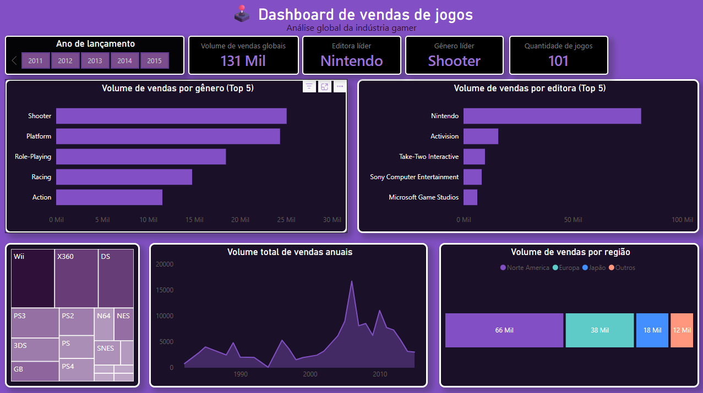

# Sales Analysis

Projeto de análise de dados de vendas desenvolvido com Python, Pandas, Matplotlib, Seaborn e Power BI.

O objetivo do projeto é explorar dados de vendas, identificar padrões de comportamento dos clientes, analisar desempenho comercial e gerar insights relevantes para tomada de decisão.

---

# Objetivos do Projeto

- Realizar limpeza e tratamento dos dados;
- Padronizar e organizar as informações;
- Explorar métricas de vendas e faturamento;
- Identificar padrões de consumo;
- Analisar desempenho de produtos e categorias;
- Construir visualizações e dashboards;
- Gerar insights estratégicos para o negócio.

---

# Tecnologias Utilizadas

- Python
- Pandas
- NumPy
- Matplotlib
- Seaborn
- Jupyter Notebook
- Looker Studio
- Power BI

---

# Estrutura do Projeto

```txt
sales-analysis/
│
├── data/
│   ├── processed/
│   │   ├── coffeeshop_tratado.csv
│   │   └── games_dashboard.csv
│   │
│   └── raw/
│       └── coffeeshop.csv
│
├── notebooks/
│   └── cafeteria.ipynb
│   
├── dashboard/
│   ├── Games.pdf
│   ├── Cafeteria.pdf
│   └── Games.pbix
│
├── images/
│
├── LICENSE
└── README.md
```

---

# Dashboards em Power BI

## Games Dashboard
<p align="center">
  
</p>